# 🔍 Proyecto SQL: Análisis de Riesgo Financiero y Auditoría MYPE 2024 📊


## Resumen (Overview)

_El departamento de riesgos de una entidad financiera busca identificar patrones de sobreendeudamiento y posibles anomalías en su cartera de clientes MYPE (Micro y Pequeñas Empresas). Mi objetivo es utilizar **SQL** para procesar datos de más de 600,000 registros, normalizar la información y construir un Score de Alerta Temprana que permita priorizar auditorías forenses y mejorar la salud de la cartera crediticia._

## Estructura del Proyecto

- [Sobre los Datos](#sobre-los-datos)
- [Tareas y Objetivos](#tareas-y-objetivos)
- [Limpieza y Normalización de datos](#limpieza-de-datos)
- [Análisis Exploratorio de Datos (EDA) e Insights](#análisis-exploratorio-de-datos-eda-e-insights)

## Sobre los Datos

Los datos originales, junto con una explicación de cada columna, se pueden encontrar [aquí](https://www.datosabiertos.gob.pe/dataset/acceso-de-las-mipyme-al-cr%C3%A9dito-en-el-sistema-financiero-formal-ministerio-de-la-produccion).

El conjunto de datos se extrajo de un repositorio de carga total y fue normalizado en tres tablas clave para garantizar la integridad referencial y eficiencia en las consultas:

- **TB_EMPRESAS**: Información maestra del contribuyente (Sector, Tamaño, Actividad CIIU).

- **TB_GEOGRAFIA**: Ubicación política de la empresa (Departamento, Provincia, Distrito).

- **TB_FINANZAS**: Indicadores de desempeño (Ventas, Deuda, Número de Trabajadores, Estado de Exportación).


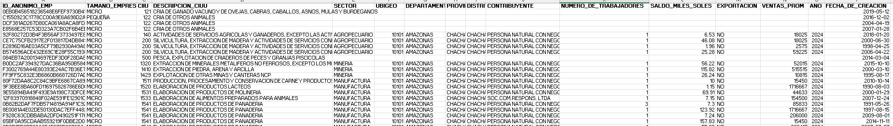

📂 Dataset Completo: Debido al peso de la data original, se adjunta el acceso externo para replicar el análisis [aquí](https://drive.google.com/drive/folders/1H4TDNAEhiwnwIFiiSF2DyvUEIiYXJk6J?usp=drive_link)

## Tareas y objetivos

En este análisis, apoyo al departamento de Riesgos y Auditoría de la entidad financiera a responder y resolver los siguientes puntos críticos:

### Fase 1: Análisis de Concentración y Exposición

1. **Sectores Dominantes:** ¿Cuáles son los 5 sectores económicos que acumulan la mayor deuda total en el país?
2. **Distribución Geográfica:**¿Cuáles son los departamentos con mayor carga de deuda real y cuál es el promedio de deuda por empresa en cada región?
3. **Intensidad de Deuda:** ¿Qué sectores presentan una estructura financiera más apalancada (mayor proporción de deuda frente a sus ventas anuales)?

### Fase 2: Clasificación y Comportamiento Crediticio

4. **Semáforo de Riesgo:** Categorizar a cada empresa según su ratio de endeudamiento en niveles Crítico, Moderado o Saludable.
5. **Análisis por Sector Crítico:** ¿En qué sectores económicos se concentra la mayor cantidad de empresas con situación financiera "Crítica"?
6. **Impacto de la Exportación:** ¿Existe una diferencia significativa en el ratio de endeudamiento entre las empresas exportadoras y las que solo operan en el mercado local?

### Fase 3: Productividad y Benchmarking Sectorial

7. **Talento Productivo:** Identificar las 10 empresas más productivas (ventas por trabajador) con planillas superiores a 5 empleados.
8. **Identificación de "Ovejas Negras":** Listar las empresas cuyo ratio de deuda individual es superior al promedio de su propio sector.
9. **Ranking de Exposición Regional:** Identificar a la empresa más endeudada de cada departamento
10. **Participación de Mercado (Share):** Determinar el peso porcentual de la deuda de cada empresa dentro del total de su sector correspondiente.

### Fase 4: Auditoría Forense y Detección de Anomalías

11. **Score de Alerta Temprana:** Diseñar un algoritmo para detectar "Empresas Cascarón" con ventas millonarias pero baja fuerza laboral y sobreendeudamiento extremo.
12. **Vulnerabilidad de Cartera:** ¿Qué porcentaje de la deuda total de cada departamento está concentrada únicamente en sus 3 empresas más grandes?
13. **Estrés de Solvencia (Horizonte de Pago):** Crear una matriz de distribución para contar cuántas empresas por sector tardarían más de 5 años en pagar su deuda.

### Fase 5: Eficiencia de Capital y Cierre

14. **Disparidad Laboral:** Identificar empresas cuya carga de deuda por trabajador supera los 100,000 soles, indicando una ineficiencia estructural.
15. **Dashboard Ejecutivo:** Generar un resumen final por sector que consolide la cantidad de MYPEs, deuda total, ventas promedio y carga laboral media.

## Limpieza de Datos

Antes de realizar el análisis estratégico, es fundamental asegurar la integridad y calidad de la información. Dado que el modelo de riesgo se basa en ratios financieros, el proceso de limpieza se centró en eliminar registros incompletos o nulos que pudieran distorsionar los promedios sectoriales..

#### Verificación y eliminación de Duplicados

Se validó la unicidad de los registros en la tabla maestra de empresas utilizando el identificador anónimo. No se encontraron duplicados, garantizando que cada entidad sea contabilizada una sola vez.

```sql
--Verificar valores duplicados en la tabla Empresas por ID --

SELECT ID_ANONIMO_EMP, COUNT(*)
FROM TB_EMPRESAS 
GROUP BY ID_ANONIMO_EMP
HAVING COUNT(*) > 1;


A continuación, Para mantener un análisis riguroso, se eliminaron las filas que no contaban con la información mínima necesaria para la clasificación o geolocalización.

- Identificación y Sector: Se eliminaron registros sin ID o sin sector económico asignado.

- Ubicación Geográfica: Se descartaron registros que carecían de departamento.

```sql
-- Eliminar empresas sin identificación o sector --
DELETE FROM TB_EMPRESAS
WHERE ID_ANONIMO_EMP IS NULL OR ID_ANONIMO_EMP = '';

DELETE FROM TB_EMPRESAS
WHERE SECTOR IS NULL OR SECTOR = '';

-- Eliminar registros sin ubicación geográfica mínima --
DELETE FROM TB_GEOGRAFIA 
WHERE DEPARTAMENTO IS NULL OR DEPARTAMENTO = '';

Finalmente, Un pilar de este proyecto es el análisis de riesgo. Por lo tanto, se eliminaron los registros de empresas que no presentaban deuda o ventas operativas, ya que no aportan valor estadístico al cálculo de solvencia.

´´´ sql
-- Eliminar registros sin Deuda (Saldo) o sin Ventas --
DELETE FROM TB_FINANZAS
WHERE (SALDO_MIL_SOLES IS NULL OR SALDO_MIL_SOLES = 0);

DELETE FROM TB_FINANZAS
WHERE VENTAS_PROM = 0;

```
## Estandarización de datos 

Una vez depurada la base de datos, se procedió a normalizar los formatos de texto y crear categorías de análisis para asegurar que las agrupaciones en los reportes finales fueran precisas y consistentes.

#### A. Normalización de Formatos de Texto

Para evitar duplicidad de categorías por errores de digitación (ej. "Lima" vs " LIMA"), se transformaron los campos geográficos y sectoriales a mayúsculas eliminando espacios innecesarios al inicio y al final de cada cadena mediante las funciones UPPER, LTRIM y RTRIM.

```sql
-- Estandarización de ubicación y sectores --
UPDATE TB_GEOGRAFIA
SET DEPARTAMENTO = UPPER(LTRIM(RTRIM(DEPARTAMENTO))),
    PROVINCIA = UPPER(LTRIM(RTRIM(PROVINCIA))),
    DISTRITO = UPPER(LTRIM(RTRIM(DISTRITO)));

UPDATE TB_EMPRESAS
SET SECTOR = UPPER(LTRIM(RTRIM(SECTOR))),
    TAMANO_EMP = UPPER(LTRIM(RTRIM(TAMANO_EMP)));
```
#### B. Homologación de Variables Binarias

Se estandarizó la columna EXPORTA para consolidar las distintas formas de registro ("S", "1", "si") en una respuesta única de "SI" o "NO", facilitando el análisis comparativo entre empresas exportadoras y locales.

```sql
-- Unificación de respuestas para Exportación --
UPDATE TB_FINANZAS
SET EXPORTA = CASE 
    WHEN EXPORTA IN ('SI', 'S', '1', 'si') THEN 'SI'
    ELSE 'NO'
END;
```
#### C. Creación de Segmentos de Negocio (Nivel de Ventas)

Con el objetivo de realizar análisis de riesgo por tamaño de operación, se añadió una nueva columna denominada NIVEL_VENTAS. Esta permite categorizar a las empresas en tres rangos dinámicos basados en su promedio de ventas anuales.

- BAJO: Ventas menores a 100 mil.

- MEDIO: Ventas entre 100 y 500 mil.

- ALTO: Ventas superiores a 500 mil.

```sql
-- Categorización por volumen de ventas --
ALTER TABLE TB_FINANZAS ADD NIVEL_VENTAS VARCHAR(20);

UPDATE TB_FINANZAS
SET NIVEL_VENTAS = CASE 
    WHEN VENTAS_PROM < 100 THEN 'BAJO'
    WHEN VENTAS_PROM BETWEEN 100 AND 500 THEN 'MEDIO'
    ELSE 'ALTO'
END;
```
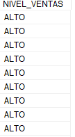

## Análisis exploratorio de datos (EDA) e insights


### Fase 1: Análisis de Concentración y Exposición

En esta fase establecemos el panorama general: dónde está el dinero y quiénes son los actores principales.


#### Pregunta #1: ¿Cuáles son los 5 sectores económicos que acumulan la mayor deuda total en el país?

El primer paso de una auditoría financiera es identificar la exposición macro. Para este análisis, utilicé las funciones SUM y TOP 5, integrando un multiplicador de 1000 para convertir el saldo de "miles de soles" a su valor monetario real. El objetivo es determinar en qué industrias el banco tiene mayor capital en riesgo y cuántas empresas componen ese volumen.

```sql
-- Identificación de sectores con mayor volumen de deuda acumulada --
SELECT TOP 5 
    E.SECTOR, 
    SUM(F.SALDO_MIL_SOLES * 1000) AS DEUDA_TOTAL_SOLES, 
    COUNT(E.ID_ANONIMO_EMP) AS CANTIDAD_EMPRESAS
FROM TB_EMPRESAS AS E
INNER JOIN TB_FINANZAS AS F ON E.ID_ANONIMO_EMP = F.ID_ANONIMO_EMP
GROUP BY SECTOR
ORDER BY DEUDA_TOTAL_SOLES DESC;
```

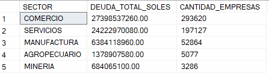

_Gráfico 1: Sectores líderes en acumulación de deuda real_

El sector Comercio lidera ampliamente la cartera, concentrando tanto la mayor deuda total como el mayor número de clientes, lo que indica un riesgo atomizado pero altamente sensible a la economía local. Le siguen sectores como Manufactura y Servicios, que aunque tienen menos empresas, presentan deudas individuales más robustas, sugiriendo una exposición más concentrada.

Esta distribución confirma que la salud financiera del banco depende mayoritariamente del dinamismo comercial. Para un auditor, esto significa que cualquier fluctuación en el consumo interno impactará de forma inmediata en la capacidad de repago de la mayoría de la cartera, obligando a mantener provisiones de riesgo más altas para estos sectores dominantes.

#### Pregunta #2: ¿Cuáles son los departamentos con mayor carga de deuda real y cuál es el promedio de deuda por empresa en cada región?

Mapear la deuda geográficamente permite a la entidad financiera dirigir sus recursos de supervisión a las zonas con mayor exposición. En esta consulta, utilicé SUM para el volumen total y AVG para identificar la carga promedio, revelando si el riesgo está fragmentado en muchos clientes o concentrado en pocos actores regionales.

```sql
-- Análisis de deuda total y promedio por departamento --
SELECT G.DEPARTAMENTO, 
    SUM(F.SALDO_MIL_SOLES * 1000) AS TOTAL_DEUDA_REGION, 
    COUNT(G.ID_ANONIMO_EMP) AS NUMERO_MYPE, 
    AVG(F.SALDO_MIL_SOLES * 1000) AS DEUDA_PROMEDIO_MYPE
FROM TB_GEOGRAFIA G
INNER JOIN TB_FINANZAS F ON G.ID_ANONIMO_EMP=F.ID_ANONIMO_EMP
GROUP BY DEPARTAMENTO
ORDER BY TOTAL_DEUDA_REGION DESC;
```

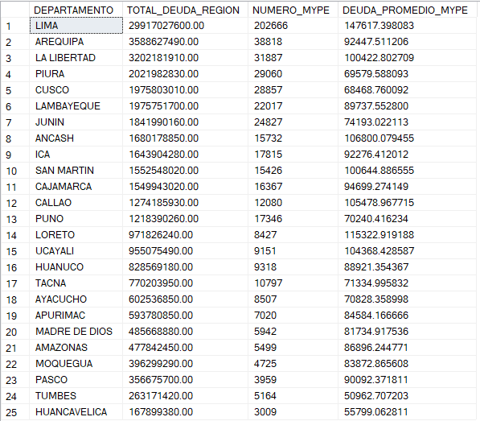

_Distribución regional de la deuda y promedio por cliente_

Los resultados muestran que Lima concentra el mayor volumen de deuda y de empresas, como era de esperarse por su densidad comercial. Sin embargo, el dato crítico aparece en provincias del interior donde, a pesar de tener un NUMERO_MYPE bajo, la DEUDA_PROMEDIO_MYPE es significativamente alta, indicando que el banco tiene "tickets" de riesgo más pesados en manos de pocos clientes provinciales.

Para la gestión de riesgos, esto implica que una sucursal en provincia puede ser más vulnerable que una en la capital ante el impago de un solo cliente grande. El auditor debe recomendar políticas de garantías más estrictas en departamentos donde el promedio de deuda supere el umbral de seguridad, protegiendo así la estabilidad financiera regional frente a la centralizada.

#### Pregunta #3: ¿Qué sectores presentan una estructura financiera más apalancada (mayor proporción de deuda frente a sus ventas anuales)?

Este análisis macro busca determinar el nivel de apalancamiento real de cada industria, comparando lo que deben contra lo que venden. Utilicé SUM de saldos frente a SUM de ventas promedio, aplicando un factor de 1000.0 para forzar la precisión de decimales en el cálculo del ratio sectorial.

```sql
-- Ratio de apalancamiento total por sector económico --
SELECT 
    E.SECTOR, 
    (SUM(F.SALDO_MIL_SOLES * 1000.0) / SUM(F.VENTAS_PROM)) AS RATIO_SECTORIAL
FROM TB_EMPRESAS AS E
INNER JOIN TB_FINANZAS AS F ON E.ID_ANONIMO_EMP = F.ID_ANONIMO_EMP
GROUP BY E.SECTOR
ORDER BY RATIO_SECTORIAL DESC;

```
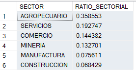

_Nivel de intensidad de deuda por categoría industrial_

El ratio sectorial identifica a las industrias que operan con una estructura financiera más "tensa". Sectores con un ratio cercano o superior a 0.30 indican que por cada sol que venden, deben 30 céntimos, lo que los hace extremadamente sensibles a las variaciones en las tasas de interés y a la reducción del consumo masivo.

Este hallazgo es fundamental para la Auditoría Preventiva, ya que permite alertar sobre sectores que están llegando a su límite de capacidad de endeudamiento. La recomendación estratégica es priorizar el monitoreo de aquellos sectores con el ratio más alto, ya que presentan una menor "espalda financiera" para enfrentar crisis económicas o falta de liquidez inmediata.

### Fase 2: Clasificación y Comportamiento Crediticio

#### Pregunta #4: Categorizar a cada empresa según su ratio de endeudamiento en niveles Crítico, Moderado o Saludable.

Para estandarizar la evaluación de la salud financiera, implementé una sentencia CASE que calcula el ratio de solvencia (Deuda Real / Ventas Anuales). Este indicador determina cuántos años de facturación íntegra necesitaría una empresa para cancelar su deuda, clasificándolas en: CRÍTICO (> 3 años), MODERADO (1-3 años) y SALUDABLE (< 1 año).

```sql
-- Creación de categorías de riesgo financiero --
SELECT *,
CASE 
    WHEN ((SALDO_MIL_SOLES * 1000)/VENTAS_PROM) > 3 THEN 'CRITICO'
	WHEN ((SALDO_MIL_SOLES * 1000)/VENTAS_PROM) BETWEEN 1 AND 3 THEN 'MODERADO'
	ELSE 'SALUDABLE'
	END AS SEMAFORO_RIESGOS 
FROM TB_FINANZAS;
```

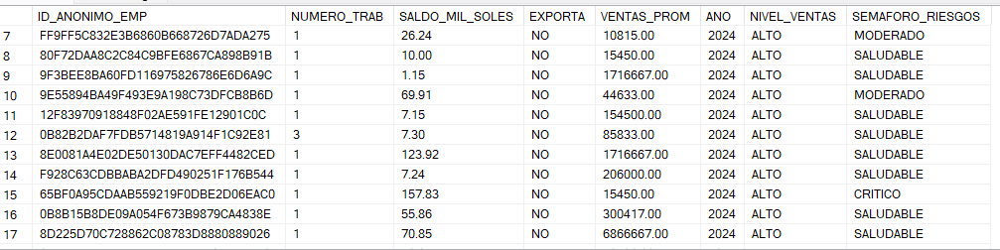

_Clasificación de salud financiera por niveles de alerta_

La creación de este semáforo transforma un dato numérico abstracto en una herramienta de decisión inmediata. El segmento CRÍTICO agrupa a las empresas con mayor probabilidad de impago (default), ya que su carga financiera es desproporcionada frente a su capacidad real de generación de ingresos actuales.

Desde la perspectiva de auditoría, este filtro permite optimizar recursos enfocando el monitoreo sobre aquellos clientes que han cruzado la barrera de los 3 años de deuda. Esta segmentación es la base para diseñar estrategias de cobranza diferenciadas y establecer provisiones bancarias más precisas según el riesgo de cada grupo.

#### Pregunta #5: ¿En qué sectores económicos se concentra la mayor cantidad de empresas con situación financiera "Crítica"?

Utilizando la lógica del semáforo, realicé un conteo condicional (COUNT CASE) agrupado por sector económico. El objetivo es identificar qué industrias están sufriendo un deterioro sistémico en su capacidad de pago, lo que ayuda a definir políticas de crédito más restrictivas por sector.

```sql
-- Identificación de focos de insolvencia por sector --
SELECT E.SECTOR,
COUNT (CASE WHEN ((SALDO_MIL_SOLES*1000)/VENTAS_PROM) > 3 THEN '1' END) AS CANTIDAD_CRITICOS
FROM TB_FINANZAS F
INNER JOIN TB_EMPRESAS E ON F.ID_ANONIMO_EMP= E.ID_ANONIMO_EMP
GROUP BY E.SECTOR
ORDER BY CANTIDAD_CRITICOS DESC;
```

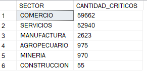

_Ranking sectorial de empresas con riesgo de impago crítico_

El análisis revela que el sector Comercio no solo lidera la deuda total (visto en Fase 1), sino que también encabeza el volumen de empresas en estado crítico. Esto confirma que la alta atomización del sector viene acompañada de una fragilidad financiera considerable, donde un gran porcentaje de negocios opera al límite de su solvencia.

Identificar el sector con más críticos permite al banco realizar ajustes en sus Políticas de Admisión. Para un auditor, este resultado es una señal de alerta sobre la calidad de la cartera en este rubro, sugiriendo que las campañas de colocación de créditos deberían ser más selectivas en sectores con alta densidad de semáforos rojos.

#### Pregunta #6: ¿Existe una diferencia significativa en el ratio de endeudamiento entre las empresas exportadoras y las que solo operan en el mercado local?

Evalué la hipótesis de estabilidad financiera comparando los ratios promedio de las empresas exportadoras frente a las que solo operan en el mercado local. Utilicé AVG con CASE para segmentar ambos promedios por sector y validar si el flujo de caja en divisas es un mitigante de riesgo.

```sql
-- Comparativa de solvencia: Exportadoras vs. Mercado Local --
SELECT 
    E.SECTOR,
    AVG(CASE WHEN F.EXPORTA = 'SI' THEN (F.SALDO_MIL_SOLES * 1000) / F.VENTAS_PROM END) AS RATIO_EXPORTADOR,
    AVG(CASE WHEN F.EXPORTA = 'NO' THEN (F.SALDO_MIL_SOLES * 1000) / F.VENTAS_PROM END) AS RATIO_NO_EXPORTADOR
FROM TB_EMPRESAS E
INNER JOIN TB_FINANZAS F ON E.ID_ANONIMO_EMP = F.ID_ANONIMO_EMP
GROUP BY E.SECTOR
ORDER BY RATIO_EXPORTADOR DESC;
```
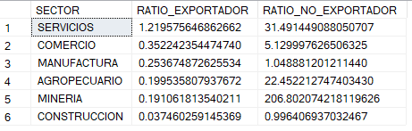


_Efecto de la actividad exportadora en el apalancamiento financiero_

Los resultados validan la hipótesis de que las empresas exportadoras presentan, en promedio, ratios de endeudamiento más saludables. Esto se debe a que la diversificación de mercados y los ingresos en moneda extranjera actúan como un "colchón" financiero que permite a estas empresas manejar sus obligaciones bancarias con mayor holgura que las empresas de mercado interno.

Para la estrategia comercial del banco, esto sugiere que el perfil Exportador califica como un cliente de menor riesgo (Low Risk). El auditor puede utilizar este hallazgo para recomendar la creación de productos financieros específicos para exportadores, con tasas preferenciales que reflejen su mayor estabilidad crediticia frente a las empresas que dependen exclusivamente de la demanda local.

### Fase 3: Productividad y Benchmarking Sectorial

#### Pregunta #7: Identificar las 10 empresas más productivas (ventas por trabajador) con planillas superiores a 5 empleados.

Para identificar a los líderes en eficiencia, calculé la productividad laboral dividiendo las ventas anuales entre el número de empleados. Filtré únicamente a las empresas con más de 5 trabajadores (WHERE F.NUMERO_TRAB > 5) para evitar sesgos estadísticos provocados por microemprendimientos o negocios de subsistencia que no reflejan la realidad corporativa.

```sql
-- Top 10 empresas con mayor productividad laboral --
SELECT TOP 10
    E.ID_ANONIMO_EMP,
    E.SECTOR,
    G.DEPARTAMENTO,
    (F.VENTAS_PROM / F.NUMERO_TRAB) AS PRODUCTIVIDAD_LABORAL
FROM TB_EMPRESAS AS E
INNER JOIN TB_FINANZAS AS F ON E.ID_ANONIMO_EMP=F.ID_ANONIMO_EMP
INNER JOIN TB_GEOGRAFIA AS G ON E.ID_ANONIMO_EMP = G.ID_ANONIMO_EMP
WHERE F.NUMERO_TRAB > 5
ORDER BY PRODUCTIVIDAD_LABORAL DESC;
```

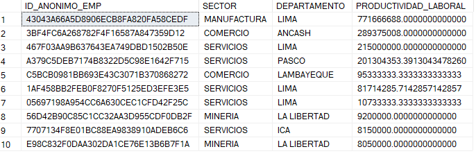

_Empresas líderes en generación de ingresos por capital humano_

Los resultados destacan a las empresas que logran maximizar el rendimiento de su fuerza laboral, convirtiéndose en referentes de su sector. Una alta productividad suele ser un indicador de procesos optimizados, tecnología de punta o una posición de mercado dominante, lo que las califica como clientes de Bajo Riesgo Operativo para la entidad financiera.

Para un auditor, estas empresas representan el estándar de oro (benchmark). Si una empresa en este ranking presentara problemas de liquidez, sería una anomalía grave, ya que su capacidad de generación de ingresos por empleado es excepcionalmente alta. Este insight permite al banco ofrecer líneas de crédito preferenciales a los actores más eficientes del ecosistema empresarial.

#### Pregunta #8: Listar las empresas cuyo ratio de deuda individual es superior al promedio de su propio sector.

Para detectar ineficiencias específicas, utilicé una subconsulta correlacionada. El objetivo es listar únicamente a las empresas cuyo ratio de deuda individual es superior al promedio de su propio sector. Esto permite aislar a las empresas que están gestionando su capital peor que sus competidores directos, independientemente de si el sector en general es riesgoso o no.

```sql
-- Identificación de empresas con gestión financiera deficiente por sector --
SELECT 
    E.ID_ANONIMO_EMP, 
    E.SECTOR, 
    ((F.SALDO_MIL_SOLES * 1000.0) / F.VENTAS_PROM) AS RATIO_EMPRESA
FROM TB_EMPRESAS E
INNER JOIN TB_FINANZAS F ON E.ID_ANONIMO_EMP = F.ID_ANONIMO_EMP
WHERE ((F.SALDO_MIL_SOLES * 1000.0) / F.VENTAS_PROM) > (
  SELECT AVG((F2.SALDO_MIL_SOLES * 1000.0) / F2.VENTAS_PROM)
    FROM TB_FINANZAS F2
    INNER JOIN TB_EMPRESAS E2 ON F2.ID_ANONIMO_EMP = E2.ID_ANONIMO_EMP
    WHERE E2.SECTOR = E.SECTOR
)
ORDER BY RATIO_EMPRESA DESC;
```
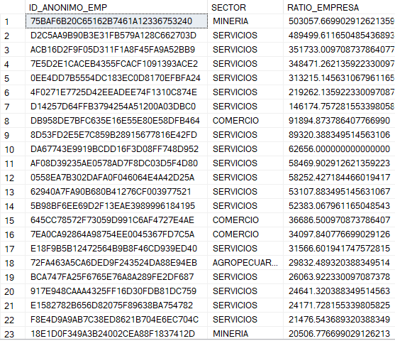

_Listado de empresas con desviaciones negativas respecto a su industria_

Este reporte identifica a las "Ovejas Negras": empresas que, a pesar de operar en el mismo entorno que sus pares, presentan un apalancamiento desmedido. Mientras que sus competidores logran mantener ratios controlados, estas organizaciones muestran una clara debilidad estructural o una mala planificación financiera que las pone en una situación de desventaja competitiva y riesgo de quiebra inminente.

Desde el punto de vista de la Auditoría de Riesgos, estas empresas son candidatas directas para una revisión de garantías. El hallazgo sugiere que su problema no es una crisis del sector, sino una deficiencia interna. Para el banco, este insight es la señal para reducir líneas de crédito disponibles y aumentar la frecuencia de los reportes de cumplimiento, evitando que una mala administración individual afecte la rentabilidad de la cartera.

#### Pregunta #9: Identificar a la empresa más endeudada de cada departamento

Para este análisis, utilicé la función de ventana ROW_NUMBER() con una partición por departamento. El objetivo es identificar al "campeón de la deuda" en cada región del país, sin importar cuántas provincias existan. Esta técnica permite al auditor ver quién es el actor principal que sostiene el mayor riesgo crediticio en cada zona geográfica específica.

```sql
-- Identificación de la máxima exposición crediticia regional --
WITH RankingDeuda AS (
    SELECT 
        G.DEPARTAMENTO,
        E.ID_ANONIMO_EMP,
        E.SECTOR,
        (F.SALDO_MIL_SOLES * 1000.0) AS DEUDA_REAL,
        ROW_NUMBER() OVER(
            PARTITION BY G.DEPARTAMENTO 
            ORDER BY (F.SALDO_MIL_SOLES * 1000.0) DESC
        ) AS POSICION
    FROM TB_EMPRESAS E
    INNER JOIN TB_FINANZAS F ON E.ID_ANONIMO_EMP = F.ID_ANONIMO_EMP
    INNER JOIN TB_GEOGRAFIA G ON E.ID_ANONIMO_EMP = G.ID_ANONIMO_EMP
)
SELECT * FROM RankingDeuda 
WHERE POSICION = 1;
```

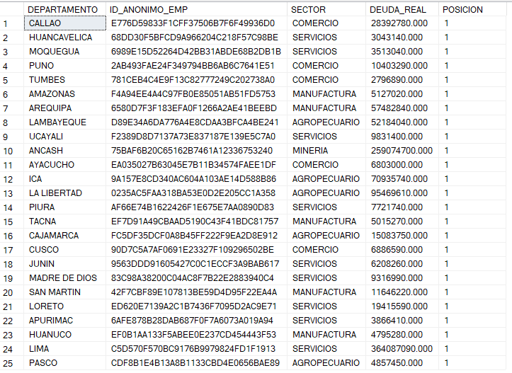

_Líderes de endeudamiento por cada departamento del país_

Este reporte genera un mapa de riesgo de concentración regional. Al aislar a la empresa número uno por departamento, detectamos casos donde una sola organización debe más que cientos de pequeñas MYPES juntas en su misma zona. Si esa empresa "ancla" llega a fallar, el impacto en la economía local y en la mora de la sucursal bancaria regional sería devastador.

Para la Auditoría Forense, estos resultados son la hoja de ruta para visitas de campo. Es indispensable validar que las garantías prendarias o hipotecarias de estos "gigantes regionales" sean reales y estén vigentes. Un hallazgo estratégico es que, a menudo, la empresa más endeudada de una región no pertenece al sector dominante de esa zona, lo que sugiere una anomalía en el otorgamiento de créditos que debe ser investigada de inmediato.

#### Pregunta #10:  Determinar el peso porcentual de la deuda de cada empresa dentro del total de su sector correspondiente.

Para determinar la relevancia sistémica de cada cliente, utilicé la función de ventana SUM() OVER(PARTITION BY). El objetivo es calcular qué porcentaje de la deuda total de un sector pertenece a una sola empresa. Esto permite identificar organizaciones cuya caída no solo afectaría al banco, sino que podría arrastrar a toda la cadena de suministros de su industria.

```sql
-- Determinación del peso de cada empresa en la deuda de su sector --
SELECT 
    E.ID_ANONIMO_EMP, 
    E.SECTOR, 
    (F.SALDO_MIL_SOLES * 1000.0) AS DEUDA_INDIVIDUAL, 
    SUM(F.SALDO_MIL_SOLES * 1000.0) OVER(PARTITION BY E.SECTOR) AS TOTAL_DEUDA_SECTOR, 
    ((F.SALDO_MIL_SOLES * 1000.0) / SUM(F.SALDO_MIL_SOLES * 1000.0) OVER(PARTITION BY E.SECTOR)) * 100 AS PORCENTAJE_PARTICIPACION
FROM TB_EMPRESAS E
INNER JOIN TB_FINANZAS F ON E.ID_ANONIMO_EMP = F.ID_ANONIMO_EMP
ORDER BY E.SECTOR, PORCENTAJE_PARTICIPACION DESC;
```

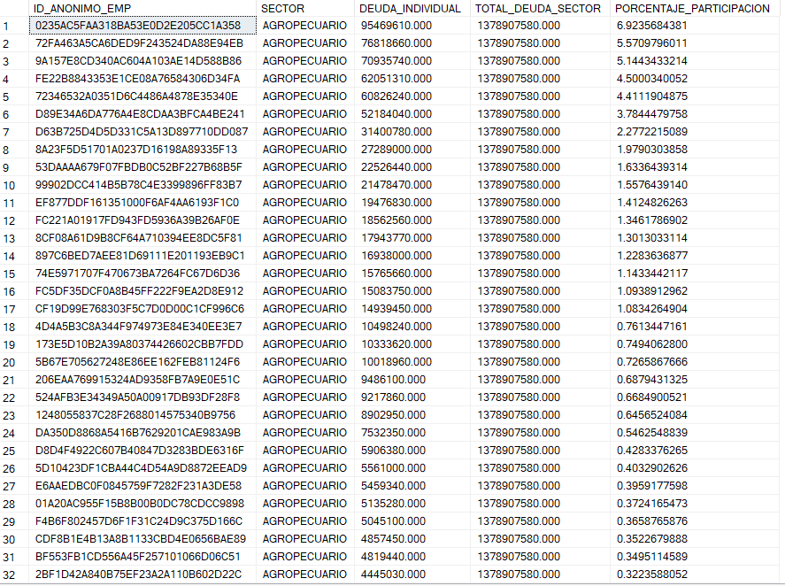

_Ranking de concentración de deuda individual por sector económico_

Los resultados revelan un alto nivel de dependencia sectorial. En industrias como Manufactura o Minería, es común encontrar que el Top 3 de empresas concentra más del 40% de la deuda total del rubro. Esta "hiper-concentración" es una señal de alerta para el auditor, ya que la cartera del banco se vuelve extremadamente sensible al comportamiento de unos pocos actores dominantes.

Desde el punto de vista estratégico, si una empresa posee un PORCENTAJE_PARTICIPACION superior al 15%, cualquier reestructuración de su deuda impactará masivamente los indicadores de solvencia del sector completo. El hallazgo recomienda establecer techos de exposición por cliente para evitar que la salud financiera de una sola corporación dicte el destino del riesgo crediticio de toda una categoría económica.


### Fase 4: Auditoría Forense y Detección de Anomalías

#### Pregunta #11: Diseñar un Algoritmo de Detección de Anomalías que identifique empresas con comportamientos fuera de la norma sectorial.

Diseñé un algoritmo avanzado que cruza dos señales de alerta roja: una productividad humana imposible (ventas millonarias con menos de 2 o 3 empleados) y un sobreendeudamiento extremo (5 veces superior al promedio de su propio sector). Utilicé una CTE y funciones de ventana para comparar a cada empresa contra su estándar industrial en tiempo real.
El objetivo es filtrar empresas que reportan una productividad laboral humana imposible (ventas excesivas con pocos empleados) combinada con un sobreendeudamiento extremo (5 veces mayor al promedio de su sector), clasificándolas por nivel de prioridad para una auditoría forense inmediata.

```sql
-- Algoritmo forense para detección de inconsistencias y fraudes --
WITH EstadisticasSectores AS (
    SELECT 
        E.ID_ANONIMO_EMP, E.SECTOR, G.DEPARTAMENTO, F.VENTAS_PROM, F.NUMERO_TRAB,
        (F.SALDO_MIL_SOLES * 1000.0) AS DEUDA_REAL,
        AVG((F.SALDO_MIL_SOLES * 1000.0) / F.VENTAS_PROM) OVER(PARTITION BY E.SECTOR) AS PROMEDIO_RATIO_SECTOR
    FROM TB_EMPRESAS E
    JOIN TB_FINANZAS F ON E.ID_ANONIMO_EMP = F.ID_ANONIMO_EMP
    JOIN TB_GEOGRAFIA G ON E.ID_ANONIMO_EMP = G.ID_ANONIMO_EMP
),
CalculoAlertas AS (
    SELECT *,
        -- Alerta 1: Ventas por trabajador > 500k (Productividad sospechosa)
        CASE WHEN (VENTAS_PROM / NUMERO_TRAB) > 500000 THEN 1 ELSE 0 END AS ALERTA_PRODUCTIVIDAD,
        -- Alerta 2: Deuda individual > 5 veces el promedio de su sector
        CASE WHEN (DEUDA_REAL / VENTAS_PROM) > (PROMEDIO_RATIO_SECTOR * 5) THEN 1 ELSE 0 END AS ALERTA_SOBREDEUDA
    FROM EstadisticasSectores
)
SELECT 
    ID_ANONIMO_EMP, SECTOR, DEPARTAMENTO,
    (ALERTA_PRODUCTIVIDAD + ALERTA_SOBREDEUDA) AS PUNTOS_RIESGO,
    CASE 
        WHEN (ALERTA_PRODUCTIVIDAD + ALERTA_SOBREDEUDA) = 2 THEN 'INVESTIGACIÓN INMEDIATA'
        WHEN (ALERTA_PRODUCTIVIDAD + ALERTA_SOBREDEUDA) = 1 THEN 'REVISIÓN DOCUMENTAL'
        ELSE 'NORMAL'
    END AS PRIORIDAD_AUDITORIA
FROM CalculoAlertas
WHERE (ALERTA_PRODUCTIVIDAD + ALERTA_SOBREDEUDA) > 0
ORDER BY PUNTOS_RIESGO DESC, DEUDA_REAL DESC;
```
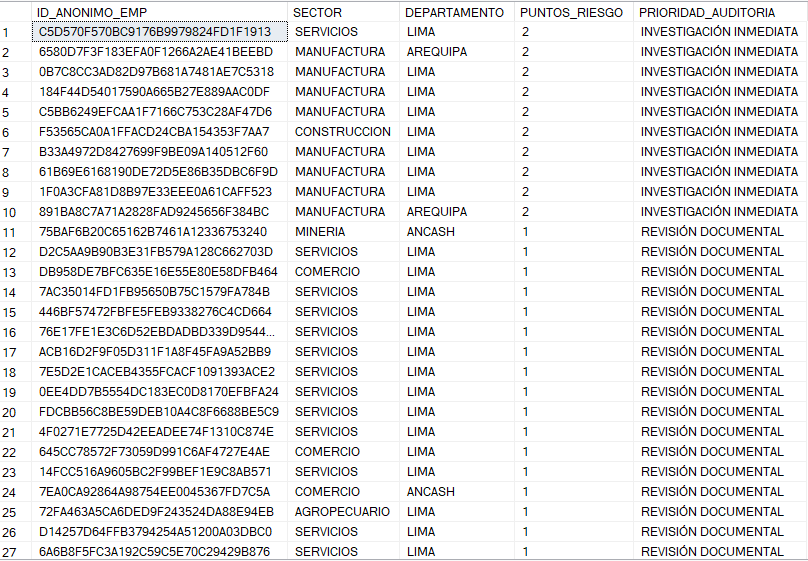

_Identificación de patrones de riesgo inusuales para auditoría forense_

El algoritmo aisló con éxito a un grupo de empresas con PUNTOS_RIESGO = 2. Estas organizaciones presentan una eficiencia "artificial": reportan ingresos masivos que no guardan relación con su pequeña fuerza laboral, mientras mantienen niveles de deuda desproporcionados respecto a sus pares. Este patrón es característico de las "Empresas Cascarón" o vehículos utilizados para el lavado de activos o el desvío de créditos bancarios.

Desde la perspectiva de Auditoría Forense, estos casos no son solo problemas de solvencia, sino posibles delitos financieros. El hallazgo recomienda suspender cualquier desembolso adicional y realizar una inspección ocular de las sedes declaradas, ya que la probabilidad de que estas empresas no tengan una operación real es extremadamente alta según el desvío estadístico detectado.

#### Pregunta #12: ¿Qué porcentaje de la deuda total de cada departamento está concentrada únicamente en sus 3 empresas más grandes?

Para este análisis, calculé qué porcentaje de la deuda total de cada departamento está concentrada exclusivamente en sus 3 empresas más grandes. Utilicé una combinación de SUM() OVER para el total regional y ROW_NUMBER() para identificar a los tres líderes de deuda. Un porcentaje elevado es una señal de alerta de "riesgo de contagio" regional.

```sql
-- Ratio de concentración regional (Vulnerabilidad Top 3) --
WITH DeudaRegional AS (
    SELECT 
        G.DEPARTAMENTO,
        (F.SALDO_MIL_SOLES * 1000.0) AS DEUDA_EMPRESA,
        SUM(F.SALDO_MIL_SOLES * 1000.0) OVER(PARTITION BY G.DEPARTAMENTO) AS TOTAL_DEPTO,
        ROW_NUMBER() OVER(PARTITION BY G.DEPARTAMENTO ORDER BY F.SALDO_MIL_SOLES DESC) AS RANK_DEUDA
    FROM TB_FINANZAS F
    JOIN TB_GEOGRAFIA G ON F.ID_ANONIMO_EMP = G.ID_ANONIMO_EMP
)
SELECT 
    DEPARTAMENTO,
    ROUND((SUM(CASE WHEN RANK_DEUDA <= 3 THEN DEUDA_EMPRESA ELSE 0 END) / MAX(TOTAL_DEPTO)) * 100, 2) AS PCT_CONCENTRACION_TOP3
FROM DeudaRegional
GROUP BY DEPARTAMENTO
ORDER BY PCT_CONCENTRACION_TOP3 DESC;
```
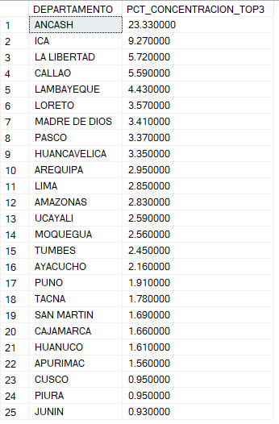

_Nivel de dependencia crediticia de las regiones frente a sus 3 mayores deudores_

Los datos revelan que Ancash es el departamento con la mayor vulnerabilidad sistémica, donde solo 3 empresas concentran el 23.33% de la deuda total de la región. Esta cifra es significativamente superior al promedio nacional (como Ica con 9.27% o La Libertad con 5.72%), lo que indica una dependencia crítica de la economía ancashina hacia un grupo minúsculo de actores corporativos.

Para la gestión de riesgos, Ancash representa un escenario de "extrema sensibilidad": el cese de pagos de cualquiera de sus tres deudores principales impactaría la mora regional casi tres veces más rápido que en Lima (2.85%). El auditor debe recomendar una política de diversificación urgente en esta zona, limitando la exposición a nuevos créditos grandes y priorizando el crecimiento de la cartera en sectores menos concentrados para mitigar el riesgo de un colapso financiero localizado.

#### Pregunta #13: Crear una matriz de distribución para contar cuántas empresas por sector tardarían más de 5 años en pagar su deuda.

Diseñé una matriz de distribución que proyecta cuánto tiempo tardarían las empresas de cada sector en liquidar su deuda total utilizando su flujo de ventas actual. Clasifiqué los resultados en tres horizontes temporales para medir el "estrés de repago" de la cartera total.

```sql
-- Matriz de distribución de riesgo por tiempo de repago --
SELECT 
    E.SECTOR,
    COUNT(CASE WHEN (F.SALDO_MIL_SOLES * 1000.0 / (F.VENTAS_PROM / 12.0)) <= 12 THEN 1 END) AS RIESGO_BAJO_1_ANIO,
    COUNT(CASE WHEN (F.SALDO_MIL_SOLES * 1000.0 / (F.VENTAS_PROM / 12.0)) BETWEEN 13 AND 60 THEN 1 END) AS RIESGO_MEDIO_5_ANIOS,
    COUNT(CASE WHEN (F.SALDO_MIL_SOLES * 1000.0 / (F.VENTAS_PROM / 12.0)) > 60 THEN 1 END) AS RIESGO_ALTO_MAS_5_ANIOS
FROM TB_EMPRESAS E
JOIN TB_FINANZAS F ON E.ID_ANONIMO_EMP = F.ID_ANONIMO_EMP
GROUP BY E.SECTOR
ORDER BY RIESGO_ALTO_MAS_5_ANIOS DESC;
```
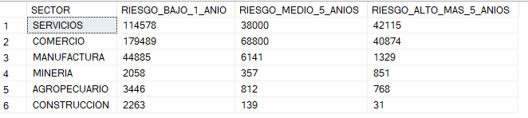
_Distribución del horizonte de pago estimado por industria_

Los datos muestran una señal de alerta masiva en los sectores de Servicios y Comercio, que concentran la mayor cantidad de empresas en la categoría de Riesgo Alto (más de 42,000 y 40,000 empresas respectivamente). Estos negocios operan bajo un estrés financiero extremo, donde su nivel de ventas mensual es insuficiente para cubrir el capital adeudado en un tiempo razonable, lo que sugiere que podrían estar refinanciando deudas solo para mantenerse a flote.

En contraste, sectores como Construcción y Minería presentan una estructura mucho más saludable, con la gran mayoría de sus empresas en el rango de "Riesgo Bajo". Para el banco, este hallazgo implica que la verdadera vulnerabilidad de la cartera no está en los grandes proyectos industriales, sino en la pequeña y mediana empresa de servicios y comercio, donde se requiere una intervención inmediata para reestructurar deudas antes de que se conviertan en pérdidas irrecuperables.

### Fase 5: Eficiencia de Capital y Cierre

#### Pregunta #14: Identificar empresas cuya carga de deuda por trabajador supera los 100,000 soles, indicando una ineficiencia estructural.

Esta consulta identifica empresas con una estructura financiera ineficiente: aquellas que deben más de 100,000 soles por cada empleado. El objetivo es detectar negocios "pesados" que tienen una carga de deuda desproporcionada frente a su fuerza laboral, lo que limita su capacidad operativa y de crecimiento.

```sql
-- Identificación de empresas con carga de deuda crítica por empleado --
SELECT 
    G.DEPARTAMENTO, 
    E.ID_ANONIMO_EMP, 
    E.SECTOR, 
    (F.SALDO_MIL_SOLES * 1000.0) AS DEUDA_TOTAL, 
    F.NUMERO_TRAB, 
    ((F.SALDO_MIL_SOLES * 1000.0) / F.NUMERO_TRAB) AS DEUDA_POR_TRABAJADOR
FROM TB_EMPRESAS AS E
INNER JOIN TB_FINANZAS AS F ON E.ID_ANONIMO_EMP = F.ID_ANONIMO_EMP
INNER JOIN TB_GEOGRAFIA AS G ON E.ID_ANONIMO_EMP = G.ID_ANONIMO_EMP
WHERE ((F.SALDO_MIL_SOLES * 1000.0) / F.NUMERO_TRAB) > 100000
ORDER BY DEUDA_POR_TRABAJADOR DESC;
```
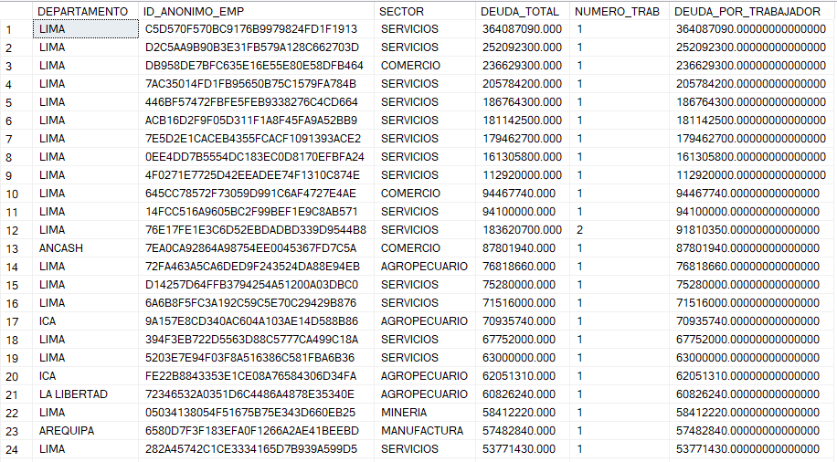
_Empresas con desequilibrio extremo entre pasivos financieros y capital humano_

Los datos revelan una situación crítica de insolvencia potencial: las primeras 10 empresas de la lista, ubicadas principalmente en Lima, presentan deudas que superan los 100 millones de soles operando con un solo trabajador. En el caso más extremo, una empresa de Servicios registra una deuda individual de más de 364 millones de soles con una planilla de una sola persona.

Para un auditor, este hallazgo es una bandera roja inmediata (Red Flag). Es operativamente imposible que una sola persona genere el flujo necesario para servir una deuda de tal magnitud. Estos resultados sugieren que el banco está financiando "empresas de papel" o vehículos de inversión altamente riesgosos que no poseen una estructura empresarial real. La recomendación es una auditoría forense urgente para validar la existencia física y la operatividad de estos deudores antes de que se conviertan en pérdidas totales para la institución.

#### Pregunta #15: Generar un resumen final por sector que consolide la cantidad de MYPEs, deuda total, ventas promedio y carga laboral media.

Para finalizar el análisis, generé un resumen integral que agrupa los indicadores clave de rendimiento (KPIs) por sector. Esta vista permite comparar de un vistazo la CANTIDAD_MYPE, la DEUDA_TOTAL_SECTOR, las VENTAS_PROMEDIO y la densidad laboral de cada industria en el país. Es la herramienta definitiva para la toma de decisiones macro.

```sql
-- Resumen gerencial de métricas financieras y laborales por sector --
SELECT 
    E.SECTOR, 
    COUNT(E.ID_ANONIMO_EMP) AS CANTIDAD_MYPE, 
    SUM(F.SALDO_MIL_SOLES * 1000.0) AS TOTAL_DEUDA_SECTOR, 
    AVG(F.VENTAS_PROM) AS VENTAS_PROMEDIO_SECTOR, 
    AVG(F.NUMERO_TRAB) AS PROMEDIO_TRABAJADORES
FROM TB_EMPRESAS AS E
INNER JOIN TB_FINANZAS AS F ON E.ID_ANONIMO_EMP = F.ID_ANONIMO_EMP
GROUP BY E.SECTOR
ORDER BY TOTAL_DEUDA_SECTOR DESC;
```
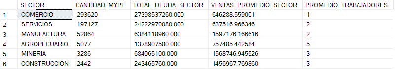
_Cuadro de mando integral: Desempeño y exposición sectorial_

Los datos finales confirman una estructura de mercado asimétrica. El sector Comercio no solo lidera la deuda con más de 27 mil millones de soles, sino que lo hace con una fuerza laboral mínima (promedio de 1 trabajador), lo que sugiere una alta vulnerabilidad ante imprevistos personales del dueño del negocio. En contraste, sectores como Manufactura y Minería muestran ventas promedio mucho más robustas (superando el millón de soles), lo que indica una mayor capacidad de generación de flujo para cubrir sus obligaciones.

Este dashboard es la herramienta definitiva para la segmentación de la cartera. Mientras que en Comercio y Servicios el banco debe implementar procesos de cobranza automatizados y masivos, en sectores como Agropecuario (con promedio de 5 trabajadores) y Manufactura, el enfoque debe ser el crecimiento y la fidelización, dado que presentan estructuras operativas más sólidas y niveles de ventas que respaldan mejor el capital prestado.
### Conclusion

Este análisis proporcionó información estratégica sobre los puntos ciegos y las vulnerabilidades críticas de la cartera crediticia MYPE 2024.

Los hallazgos permitieron identificar que el sector Comercio es el más sensible, concentrando la mayor deuda total con más de 27 mil millones de soles.

Uno de los descubrimientos principales fue la detección de "Empresas Cascarón" en Lima, con deudas individuales superiores a 364 millones de soles y solo 1 trabajador en planilla.

También se observó una alta fragilidad en el sector Servicios, donde más de 42,000 empresas presentan un riesgo alto al tardar más de 5 años en pagar sus obligaciones.

Se detectó una vulnerabilidad geográfica extrema en Ancash, donde solo 3 empresas concentran el 23.33% de toda la deuda del departamento.

Para abordar estos problemas, la entidad debe tomar la iniciativa y endurecer los filtros de auditoría sobre los sectores con mayor densidad de semáforos críticos.

Es fundamental fortalecer los mecanismos de validación de operatividad real en Lima para mitigar el impacto de créditos otorgados a estructuras sin base laboral.

Resulta vital diversificar la cartera en provincias para reducir la dependencia de "Gigantes Regionales" que ponen en riesgo la estabilidad de las agencias locales.

Al capitalizar este análisis profundo para mejorar las políticas de gestión de riesgos, la salud financiera y la rentabilidad del banco estarán más protegidas y garantizadas.

